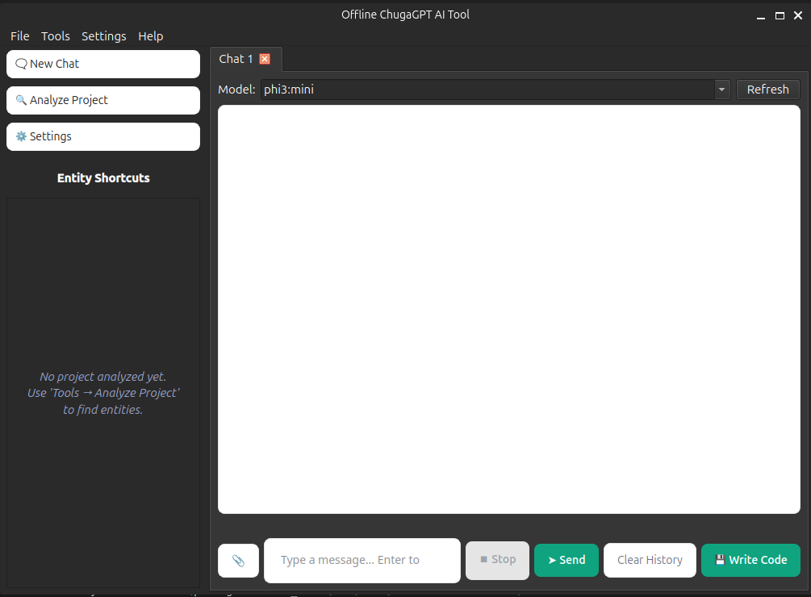
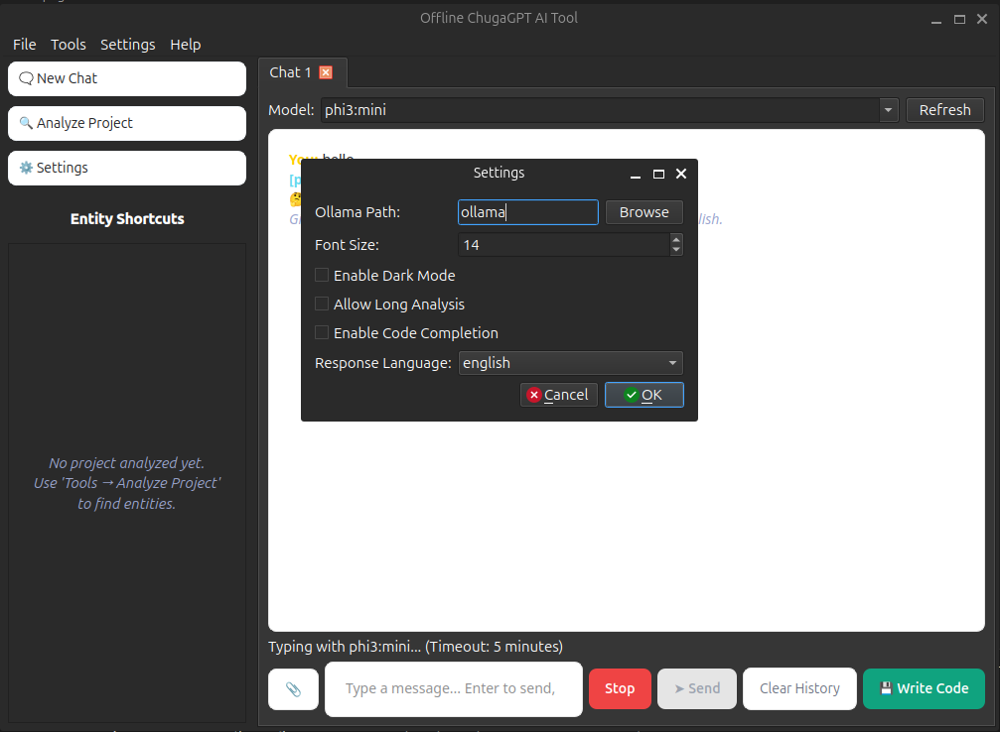
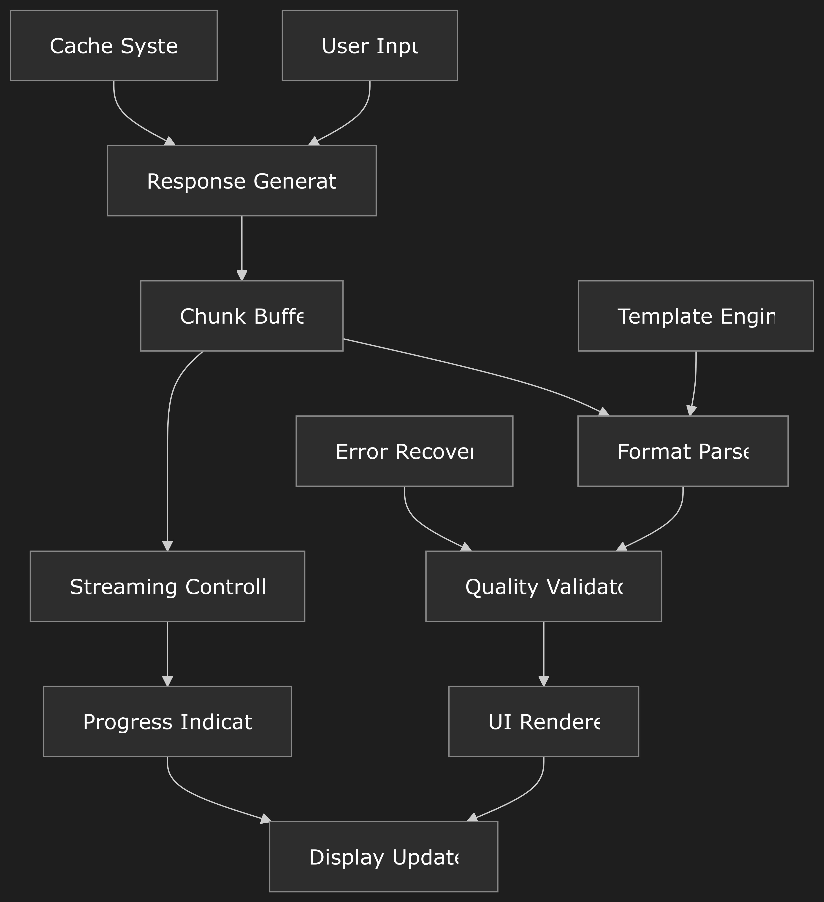
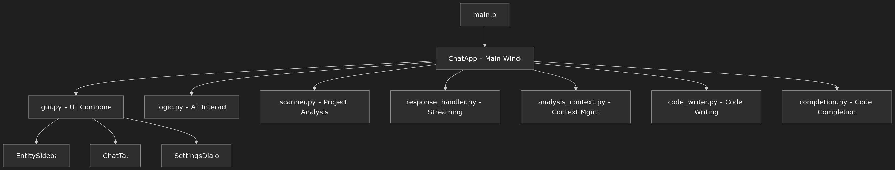
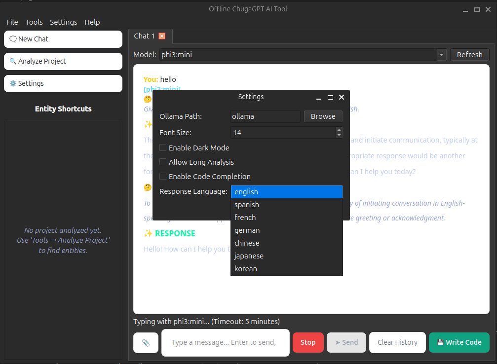

# ChugaGPT - Offline AI Development Assistant
 


ChugaGPT is a powerful AI-powered development tool with a modern GUI interface. It integrates with Ollama for offline AI and supports cloud models (OpenAI, Anthropic, Google) to provide intelligent code analysis, project insights, and AI-powered chat functionality.

## ✨ Features

### Core Features
- **Multi-Model Support**: Use Ollama (offline) or cloud models (OpenAI, Anthropic, Google Gemini)
- **Offline AI Chat**: Communicate with various AI models locally using Ollama
- **Cloud Model Support**: Connect to OpenAI GPT-4, Anthropic Claude, Google Gemini
- **Project Analysis**: Deep code analysis with issue detection and suggestions
- **Multi-Tab Interface**: Manage multiple chat sessions simultaneously
- **Code Entity Browser**: Quick access to classes, functions, and methods
- **Dark Theme**: Modern Warp-inspired dark theme for comfortable coding

### Advanced AI Features
- **Multi-Agent System**: Anthropic-style agentic AI with team collaboration
- **Team Setup**: Configure multiple AI agents working together on complex tasks
- **Tool Integration**: AI can execute bash commands, read/write/edit files, search code
- **Skills System**: Load custom skills from `.skills/` directory (file_search, write, edit, bash, explore, code_analysis, read_file)
- **Task Agent**: Background exploration and analysis tasks with improved dialog
- **Auto Model Scan**: Automatically detect newly downloaded Ollama models

### Development Features
- **Syntax Highlighting**: Built-in code highlighting for better readability
- **Code Completion**: Real-time code completion suggestions
- **File Operations**: AI can create, edit, and manage files
- **Bash Execution**: Run shell commands directly from chat
- **Model Management**: Easy switching between different AI models
- **Project Scanning**: Comprehensive project structure analysis
- **History Management**: Persistent chat history across sessions

### Packaging & Distribution
- **Standalone Executables**: Ready-to-use builds for Linux and Windows in `preview/` directory
- **User-Friendly Launchers**: `Run_Chugagpt_Linux.sh` and `Run_Chugagpt_Windows.bat`
- **Fixed UI Elements**: Text input field maintains 80px fixed height (won't squeeze after analysis)
- **Preview Directory**: Contains build scripts, launchers, and documentation
- **One-Click Setup**: `setup_linux.sh` handles everything automatically

## 📦 Packaging for Users

### For Non-Technical Users

ChugaGPT can be packaged as standalone executables:

**Linux**:
```bash
cd preview/
./build_linux.sh
# Executable: preview/dist/linux/Chugagpt_Offline_Tool
```

**Windows**:
```bash
cd preview/
build_windows.bat
# Executable: preview\dist\windows\Chugagpt_Offline_Tool.exe
```

### User-Launcher Scripts

After packaging, users can simply:
- **Linux**: Double-click `Run_Chugagpt_Linux.sh`
- **Windows**: Double-click `Run_Chugagpt_Windows.bat`

These scripts automatically:
1. Check for Python
2. Create virtual environment
3. Install dependencies
4. Start the application

### First-Time Setup

Users need to install Ollama first:
```bash
# Linux
curl -fsSL https://ollama.com/install.sh | sh
ollama pull llama3.2

# Windows: Download from https://ollama.com/download
```

## 🔧 Enhanced Task Agent

### New Task Agent Dialog

Click "Task Agent" in sidebar to open an enhanced dialog with:

**Run Tasks Tab**:
- Execute explore, search, and read_file tasks
- View real-time output
- Background execution with threading

**Skills Tab**:
- Enable/disable agent skills with checkboxes
- View skill descriptions and triggers
- Refresh skills list

**Results Tab**:
- View recent task results
- Track task history
- Monitor background tasks

### Available Skills (7 Total)

| Skill | Description | Triggers |
|-------|-------------|----------|
| file_search | Search and explore files | find file, search, grep |
| write | Write content to files | write, create file, save to file |
| edit | Edit files by replacing text | edit, modify file, replace in file |
| bash | Execute shell commands | bash, run command, execute |
| explore | Explore codebase with tools | explore, find files, search code |
| code_analysis | Analyze code quality | analyze code, review code, lint |
| read_file | Read file contents | read, show, view, cat |

The AI can now actively modify your project - creating new files, editing existing code, and running commands!

## 📸 Screenshots

### Main Interface


*ChugaGPT's modern dark-themed interface with multi-tab chat support.*

### Project Analysis





*Project analysis feature showing code insights and AI suggestions.*

## 🚀 Prerequisites

Before installing ChugaGPT, ensure you have the following:

- **Python 3.8+** - The application is built with Python
- **Ollama** - Local AI model server (installation instructions below)
- **Git** - For cloning the repository (optional)
- **Cloud API Keys** (Optional) - OpenAI, Anthropic, or Google API keys for cloud models

### System Requirements

- **Operating System**: Linux, macOS, or Windows
- **RAM**: Minimum 8GB (16GB recommended for larger models)
- **Storage**: At least 10GB free space for AI models
- **Display**: 1920x1080 or higher resolution recommended

## 📦 Installation

### Step 1: Download Ollama

Ollama is required to run AI models locally. Download and install it for your operating system:

#### Linux
```bash
curl -fsSL https://ollama.ai/install.sh | sh
```

#### macOS
Download from: [https://ollama.ai/download](https://ollama.ai/download)

#### Windows
Download the installer from: [https://ollama.ai/download](https://ollama.ai/download)

Verify installation:
```bash
ollama --version
```

### Step 2: Download AI Models

#### Offline Models (Ollama)

ChugaGPT works with various Ollama models. Recommended models for different use cases:

**Code Analysis & Development (Recommended)**
```bash
# DeepSeek Coder - Excellent for code-related tasks
ollama pull deepseek-coder:6.7b

# Code Llama - Strong performance on coding tasks
ollama pull codellama:7b

# Qwen2 - Good balance of performance and speed
ollama pull qwen2:7b
```

**General Purpose AI Chat**
```bash
# Llama 3 - Versatile general-purpose model
ollama pull llama3:8b

# Mistral - Fast and capable model
ollama pull mistral:7b

# Phi-3 - Efficient and capable
ollama pull phi3:mini
```

**Specialized Models**
```bash
# For Python development
ollama pull deepseek-coder:6.7b-python

# For JavaScript/TypeScript
ollama pull deepseek-coder:6.7b-javascript
```

**Note**: Models can be large (2-10GB each). Download only what you need based on your use case.

#### Cloud Models (Optional)

To use cloud models, you'll need API keys:

1. **OpenAI**: Get your API key from [OpenAI Platform](https://platform.openai.com/api-keys)
2. **Anthropic**: Get your API key from [Anthropic Console](https://console.anthropic.com/)
3. **Google**: Get your API key from [Google AI Studio](https://ai.google.dev/)

Configure these in ChugaGPT Settings → Preferences.

### Step 3: Install ChugaGPT

#### Option 1: Download Release
1. Go to the [Releases](https://github.com/ErickWDaniel/Chugagpt_Offline_Tool/releases) page
2. Download the latest version for your operating system
3. Extract and run the executable

#### Option 2: Install from Source

Clone the repository:
```bash
git clone https://github.com/ErickWDaniel/Chugagpt_Offline_Tool.git
cd Chugagpt_Offline_Tool
```

Create a virtual environment (recommended):
```bash
python -m venv chugagpt_env
source chugagpt_env/bin/activate  # On Windows: chugagpt_env\Scripts\activate
```

Install dependencies:
```bash
pip install PySide6
pip install openai anthropic google-generativeai  # Optional: for cloud models
```

**Note**: PySide6 should be installed automatically, but you can specify it explicitly if needed.

### Step 4: Verify Installation

Test Ollama models:
```bash
ollama list
```

Run ChugaGPT:
```bash
python main.py
```

## ⚙️ Configuration

### Basic Settings

Launch ChugaGPT and access settings via:
- Menu: `Settings → Preferences`
- Settings button in sidebar

#### Model Provider Configuration
- **Ollama (Offline)**: No API key required, runs locally
- **OpenAI**: Enter your API key in settings
- **Anthropic**: Enter your API key for Claude models
- **Google**: Enter your API key for Gemini models

#### Default Settings File

Settings are stored in `settings.json`:
```json
{
    "ollama_path": "ollama",
    "font_size": 14,
    "dark_theme": true,
    "project_root": "..",
    "model_provider": "ollama",
    "model": "phi3:mini",
    "openai_api_key": "",
    "anthropic_api_key": "",
    "google_api_key": ""
}
```

### Advanced Configuration

#### Multi-Agent Team Setup

ChugaGPT supports Anthropic-style multi-agent systems:

1. Go to `Tools → AI Teams`
2. Create teams with multiple agents
3. Assign roles: Coordinator, Coder, Analyst, Reviewer, Researcher, Executor
4. Configure different models for each agent
5. Agents collaborate on complex tasks

Example team configuration:
- **Coordinator** (Claude 3.5 Sonnet): Orchestrates tasks
- **Coder** (GPT-4o): Generates code
- **Analyst** (Phi3:mini): Analyzes code quality

#### Custom Skills

Add skill definitions to `.skills/` directory:
```json
{
  "name": "file_search",
  "description": "Search and explore files in the project",
  "triggers": ["find file", "search", "grep"],
  "tools": ["glob", "grep", "read"]
}
```

## 🎯 Usage

### Getting Started

1. **Launch the Application**:
   ```bash
   python main.py
   ```

2. **Select Model Provider**:
   - Click Settings → Preferences
   - Choose provider: Ollama, OpenAI, Anthropic, or Google
   - Enter API key if using cloud models
   - Select your model

3. **Create a New Chat**:
   - Click `File → New Chat` or use `Ctrl+N`
   - Select your preferred AI model from the dropdown
   - Click refresh button to scan for new Ollama models

4. **Start Chatting**:
   - Type your message in the input box
   - Press Enter or click "Send"
   - Use `Shift+Enter` for new line

### Project Analysis

#### Analyze a Project
1. Go to `Tools → Analyze Project` or use `Ctrl+P`
2. Select your project directory
3. Wait for analysis to complete
4. Review the AI-generated suggestions and insights

#### Features of Project Analysis
- **Code Quality Assessment**: Identifies potential issues and improvements
- **Architecture Review**: Analyzes project structure and design patterns
- **Entity Discovery**: Finds classes, functions, and methods
- **Issue Prioritization**: Ranks problems by severity and impact

#### Using the Entity Sidebar
After analysis, the sidebar shows:
- **Classes**: Click to view class details and methods
- **Functions**: Access function signatures and locations
- **Quick Navigation**: Jump to specific code entities

### Advanced AI Features

#### Tool Usage (Agentic AI)

The AI can use tools when needed:

**Available Tools:**
- `glob <pattern>` - Find files matching pattern
- `grep <pattern> --include <ext>` - Search for pattern in files
- `read <file> [limit] [offset]` - Read a file
- `write <file> <content>` - Write content to file
- `edit <file> <old> <new>` - Edit file content
- `bash <command>` - Execute shell command

**Example**: AI will automatically use tools when needed:
```
You: Analyze my Python project and fix the bugs
AI: <tool>glob **/*.py</tool>
    <tool>grep "def " --include *.py</tool>
    [Uses results to analyze and suggest fixes]
```

#### Multi-Agent Collaboration

For complex tasks, use team mode:

1. Go to `Tools → AI Teams`
2. Select or create a team
3. Ask complex questions that require multiple specialists
4. Agents collaborate and provide comprehensive answers

Example: "Design a REST API with authentication, including database schema and tests"

### Skills System

Browse and use skills from the sidebar:
1. Click "Skills" button in sidebar
2. View available skills
3. Skills provide specialized capabilities and triggers

### Task Agent

Run background tasks:
1. Click "Task Agent" in sidebar
2. Agent explores codebase, searches code, reads files
3. Results appear in chat when ready

## 🔧 Troubleshooting

### Common Issues

#### Ollama Not Found

**Error**: `ollama: command not found`

**Solution**:
1. Ensure Ollama is installed
2. Add Ollama to your PATH
3. Update the Ollama path in ChugaGPT settings

#### Model Not Available

**Error**: Model not found or downloaded

**Solution**:
```bash
# Check available models
ollama list

# Pull the required model
ollama pull <model-name>
```

#### Cloud Model Errors

**Error**: API key invalid or quota exceeded

**Solution**:
1. Verify API key in Settings
2. Check API quota/billing
3. Switch to Ollama for offline use

#### GUI Not Starting

**Error**: PySide6 import errors

**Solution**:
```bash
# Install PySide6 explicitly
pip install PySide6

# On Linux, you might need additional packages
sudo apt-get install python3-pyqt6  # Ubuntu/Debian
```

#### Terminal Control Codes / ANSI Artifacts in Output

**Symptom**: You see sequences like `ESC [?25h`, `ESC [?25l`, or other gibberish characters mixed into model responses.

**Cause**: Some model backends and CLIs emit ANSI/OSC/DCS control codes meant for TTY terminals. When streamed into GUI widgets or non-TTY streams, these control codes appear as artifacts.

**Status**: Fixed in the app.
- Output is now sanitized in real-time using a streaming-safe sanitizer that buffers incomplete escape sequences across chunks.
- Additional environment flags are set for the subprocess to discourage TTY control codes at the source.

**Environment flags used** (also applied automatically by the app):
```bash
export OLLAMA_NO_COLOR=1
export NO_COLOR=1
export CLICOLOR=0
export TERM=dumb
```

If you still see artifacts after pulling the latest version, ensure you're running the updated build and that your Ollama path is correct in Settings.

#### High Memory Usage

**Problem**: Application uses too much RAM

**Solutions**:
- Use smaller models (e.g., phi3:mini instead of llama3:8b)
- Close unused chat tabs
- Restart the application periodically

#### Slow Response Times

**Problem**: AI responses are slow

**Solutions**:
- Use smaller/faster models
- Ensure adequate RAM (16GB+ recommended)
- Close other resource-intensive applications
- Check system temperature and cooling
- For Ollama: Use GPU-enabled version for better performance

## 🎯 Performance Optimization

### For Better Performance
1. **Use SSD Storage**: Models load faster from SSD
2. **Increase RAM**: More RAM allows larger models
3. **CPU vs GPU**: Use GPU-enabled Ollama for better performance
4. **Model Selection**: Choose appropriate model size for your hardware

### Memory Management
- Close analysis tabs when not needed
- Limit concurrent model usage
- Restart periodically to free memory

## 📚 Examples

### Code Analysis Example
1. Analyze a Python project
2. Ask: "Review this codebase and suggest improvements"
3. Get detailed analysis with specific recommendations

### Chat Examples
```python
# Example prompts
"Explain this Python function"
"Refactor this code for better performance"
"Write unit tests for this class"
"Convert this JavaScript to TypeScript"
"Create a REST API with authentication"
"Find and fix security vulnerabilities"
```

### Multi-Agent Example
```
Team: Development Team
Task: "Build a complete user authentication system"

Coordinator breaks down task
→ Coder writes the implementation
→ Analyst reviews code quality
→ Reviewer suggests improvements
→ Executor runs tests and validation
```

### Project Analysis Example
```
Project: MyApp
- Total Files: 45
- Lines of Code: 2,847
- Issues Found: 12

Key Issues:
- Missing error handling in 3 locations
- Unused imports in utils.py
- Potential security vulnerability in auth.py

[AI provides detailed fixes for each issue]
```

## 🤝 Contributing

We welcome contributions! Please follow these steps:

1. Fork the repository
2. Create a feature branch: `git checkout -b feature/your-feature`
3. Make your changes and test thoroughly
4. Submit a pull request with a clear description

### Development Setup
```bash
git clone https://github.com/ErickWDaniel/Chugagpt_Offline_Tool.git
cd ChugaGPT
python -m venv dev_env
source dev_env/bin/activate
pip install PySide6
pip install openai anthropic google-generativeai  # For cloud model support
python main.py
```

### Code Style
- Follow PEP 8 for Python code
- Use meaningful variable names
- Add docstrings to functions and classes
- Test your changes thoroughly
- Run lint and typecheck before submitting

## 📄 License

This project is licensed under the MIT License - see the [LICENSE](LICENSE) file for details.

## 🙏 Acknowledgments

- [Ollama](https://ollama.ai) for the local AI model server
- [PySide6](https://doc.qt.io/qtforpython/) for the GUI framework
- [OpenAI](https://openai.com), [Anthropic](https://anthropic.com), [Google](https://ai.google.dev) for cloud AI APIs
- The open-source AI community for making local AI accessible

## 📞 Support

- **Issues**: Report bugs and request features on [GitHub Issues](https://github.com/ErickWDaniel/Chugagpt_Offline_Tool/issues)
- **Discussions**: Join community discussions on [GitHub Discussions](https://github.com/ErickWDaniel/Chugagpt_Offline_Tool/discussions)
- **Documentation**: Check this README and inline code documentation

---

**Happy coding with ChugaGPT! 🚀**

*Built with ❤️ for developers who value privacy and offline capabilities*
