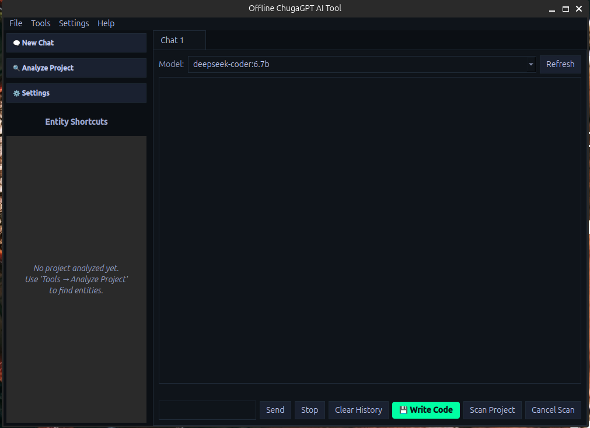

# ChugaGPT - Offline AI Development Assistant


ChugaGPT is a powerful offline AI-powered development tool with a modern GUI interface. It integrates seamlessly with Ollama to provide intelligent code analysis, project insights, and AI-powered chat functionality - all without requiring internet connectivity.

## ✨ Features

- **Offline AI Chat**: Communicate with various AI models locally using Ollama
- **Project Analysis**: Deep code analysis with issue detection and suggestions
- **Multi-Tab Interface**: Manage multiple chat sessions simultaneously
- **Code Entity Browser**: Quick access to classes, functions, and methods
- **Syntax Highlighting**: Built-in code highlighting for better readability
- **Dark Theme**: Modern Warp-inspired dark theme for comfortable coding
- **Model Management**: Easy switching between different AI models
- **Project Scanning**: Comprehensive project structure analysis
- **History Management**: Persistent chat history across sessions
- **Chat History**: Record and revisit previous conversations

## 📸 Screenshots

### Main Interface


*ChugaGPT's modern dark-themed interface with multi-tab chat support.*

### Project Analysis


*Project analysis feature showing code insights and AI suggestions.*

## 🚀 Prerequisites

Before installing ChugaGPT, ensure you have the following:

- **Python 3.8+** - The application is built with Python
- **Ollama** - Local AI model server (installation instructions below)
- **Git** - For cloning the repository (optional)

### System Requirements

- **Operating System**: Linux, macOS, or Windows
- **RAM**: Minimum 8GB (16GB recommended for larger models)
- **Storage**: At least 10GB free space for AI models
- **Display**: 1920x1080 or higher resolution recommended

## 📦 Installation

### Step 1: Download Ollama

Ollama is required to run AI models locally. Download and install it for your operating system:

#### Linux
```bash
curl -fsSL https://ollama.ai/install.sh | sh
```

#### macOS
Download from: [https://ollama.ai/download](https://ollama.ai/download)

#### Windows
Download the installer from: [https://ollama.ai/download](https://ollama.ai/download)

Verify installation:
```bash
ollama --version
```

### Step 2: Download AI Models

ChugaGPT works with various Ollama models. Here are recommended models for different use cases:

#### Code Analysis & Development (Recommended)
```bash
# DeepSeek Coder - Excellent for code-related tasks
ollama pull deepseek-coder:6.7b

# Code Llama - Strong performance on coding tasks
ollama pull codellama:7b

# Qwen2 - Good balance of performance and speed
ollama pull qwen2:7b
```

#### General Purpose AI Chat
```bash
# Llama 3 - Versatile general-purpose model
ollama pull llama3:8b

# Mistral - Fast and capable model
ollama pull mistral:7b

# Phi-3 - Efficient and capable
ollama pull phi3:mini
```

#### Specialized Models
```bash
# For Python development
ollama pull deepseek-coder:6.7b-python

# For JavaScript/TypeScript
ollama pull deepseek-coder:6.7b-javascript
```

**Note**: Models can be large (2-10GB each). Download only what you need based on your use case.

### Step 3: Install ChugaGPT

#### Option 1: Download Release
1. Go to the [Releases](https://github.com/your-repo/ChugaGPT/releases) page
2. Download the latest version for your operating system
3. Extract and run the executable

#### Option 2: Install from Source

Clone the repository:
```bash
git clone https://github.com/your-repo/ChugaGPT.git
cd ChugaGPT
```

Create a virtual environment (recommended):
```bash
python -m venv chugagpt_env
source chugagpt_env/bin/activate  # On Windows: chugagpt_env\Scripts\activate
```

Install dependencies:
```bash
pip install PySide6
```

**Note**: PySide6 should be installed automatically, but you can specify it explicitly if needed.

### Step 4: Verify Installation

Test Ollama models:
```bash
ollama list
```

Run ChugaGPT:Key Modules and Their Purposes
main.py:

Purpose: This is the main entry point of the application. It initializes the GUI and manages core application logic.
Main Functionality:
Creates and manages chat tabs.
Handles message sending and analysis.
Manages settings and project analysis.
Key Classes/Functions:
AnalysisWorker: A background thread for project analysis.
ChatApp: The main application window with methods like send_message(), analyze_project(), and create_analysis_tab().
gui.py:
```bash
python main.py
```

## ⚙️ Configuration

### Basic Settings

Launch ChugaGPT and access settings via:
- Menu: `Settings → Preferences`
- Keyboard shortcut: Usually accessible via the settings button

#### Ollama Configuration
- **Ollama Path**: Path to your Ollama executable (usually `ollama` if in PATH)
- **Font Size**: Adjust text size (8-32px)
- **Dark Theme**: Toggle between dark and light themes

#### Default Settings File

Settings are stored in `settings.json`:

```json
{
    "ollama_path": "ollama",
    "font_size": 14,
    "dark_theme": true,
    "project_root": ".."
}
```

### Advanced Configuration

#### Custom Model Lists

Modify the model list in `gui.py` or add custom models through the UI.

#### Project Root Settings

Set your default project directory in settings for easier project analysis.

## 🎯 Usage

### Getting Started

1. **Launch the Application**:
   ```bash
   python main.py
   ```

2. **Create a New Chat**:
   - Click `File → New Chat` or use `Ctrl+N`
   - Select your preferred AI model from the dropdown

3. **Start Chatting**:
   - Type your message in the input box
   - Press Enter or click "Send"

### Project Analysis

#### Analyze a Project

1. Go to `Tools → Analyze Project` or use `Ctrl+P`
2. Select your project directory
3. Wait for analysis to complete
4. Review the AI-generated suggestions and insights

#### Features of Project Analysis

- **Code Quality Assessment**: Identifies potential issues and improvements
- **Architecture Review**: Analyzes project structure and design patterns
- **Entity Discovery**: Finds classes, functions, and methods
- **Issue Prioritization**: Ranks problems by severity and impact

#### Using the Entity Sidebar

After analysis, the sidebar shows:
- **Classes**: Click to view class details and methods
- **Functions**: Access function signatures and locations
- **Quick Navigation**: Jump to specific code entities

### Advanced Features

#### Multi-Tab Chat

- Create multiple chat sessions
- Each tab can use different models
- Persistent history per tab

#### Model Switching

- Change models mid-conversation
- Refresh model list from Ollama
- Custom model support

#### Project Scanning

- Real-time project structure analysis
- File type detection
- Code metrics and statistics

## 🔧 Troubleshooting

### Common Issues

#### Ollama Not Found

**Error**: `ollama: command not found`

**Solution**:
1. Ensure Ollama is installed
2. Add Ollama to your PATH
3. Update the Ollama path in ChugaGPT settings

#### Model Not Available

**Error**: Model not found or downloaded

**Solution**:
```bash
# Check available models
ollama list

# Pull the required model
ollama pull <model-name>
```

#### GUI Not Starting

**Error**: PySide6 import errors

**Solution**:
```bash
# Install PySide6 explicitly
pip install PySide6

# On Linux, you might need additional packages
sudo apt-get install python3-pyqt6  # Ubuntu/Debian
```

#### High Memory Usage

**Problem**: Application uses too much RAM

**Solutions**:
- Use smaller models (e.g., phi3:mini instead of llama3:8b)
- Close unused chat tabs
- Restart the application periodically

#### Slow Response Times

**Problem**: AI responses are slow

**Solutions**:
- Use smaller/faster models
- Ensure adequate RAM (16GB+ recommended)
- Close other resource-intensive applications
- Check system temperature and cooling

### Performance Optimization

#### For Better Performance

1. **Use SSD Storage**: Models load faster from SSD
2. **Increase RAM**: More RAM allows larger models
3. **CPU vs GPU**: Use GPU-enabled Ollama for better performance
4. **Model Selection**: Choose appropriate model size for your hardware

#### Memory Management

- Close analysis tabs when not needed
- Limit concurrent model usage
- Restart periodically to free memory

### Logs and Debugging

Enable debug logging by modifying `utils.py` or check console output for errors.

## 📚 Examples

### Code Analysis Example

1. Analyze a Python project
2. Ask: "Review this codebase and suggest improvements"
3. Get detailed analysis with specific recommendations

### Chat Examples

```python
# Example prompts
"Explain this Python function"
"Refactor this code for better performance"
"Write unit tests for this class"
"Convert this JavaScript to TypeScript"
```

### Project Analysis Example

```
Project: MyApp
- Total Files: 45
- Lines of Code: 2,847
- Issues Found: 12

Key Issues:
- Missing error handling in 3 locations
- Unused imports in utils.py
- Potential security vulnerability in auth.py
```

## 🤝 Contributing

We welcome contributions! Please follow these steps:

1. Fork the repository
2. Create a feature branch: `git checkout -b feature/your-feature`
3. Make your changes and test thoroughly
4. Submit a pull request with a clear description

### Development Setup

```bash
git clone https://github.com/your-repo/ChugaGPT.git
cd ChugaGPT
python -m venv dev_env
source dev_env/bin/activate
pip install PySide6
python main.py
```

### Code Style

- Follow PEP 8 for Python code
- Use meaningful variable names
- Add docstrings to functions and classes
- Test your changes thoroughly

## 📄 License

This project is licensed under the MIT License - see the [LICENSE](LICENSE) file for details.

## 🙏 Acknowledgments

- [Ollama](https://ollama.ai) for the local AI model server
- [PySide6](https://doc.qt.io/qtforpython/) for the GUI framework
- The open-source AI community for making local AI accessible

## 📞 Support

- **Issues**: Report bugs and request features on [GitHub Issues](https://github.com/your-repo/ChugaGPT/issues)
- **Discussions**: Join community discussions on [GitHub Discussions](https://github.com/your-repo/ChugaGPT/discussions)
- **Documentation**: Check this README and inline code documentation

---

**Happy coding with ChugaGPT! 🚀**

*Built with ❤️ for developers who value privacy and offline capabilities*
